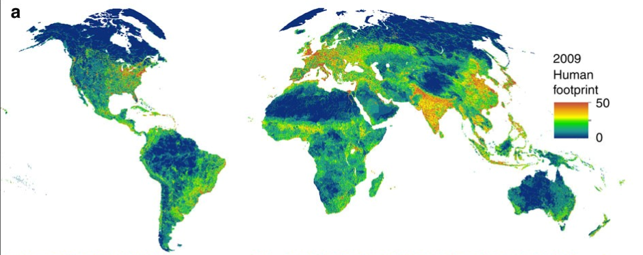

class: title-slide, left, inverse, middle

.left[
# `r rmarkdown::metadata$title` <br> `r rmarkdown::metadata$subtitle` <br> `r rmarkdown::metadata$subtitle2` 
]

.right[
## `r rmarkdown::metadata$author`
]

.right[
## `r rmarkdown::metadata$date`
]

<div style = "position:fixed; visibility: hidden">
$$\require{color}\definecolor{red}{rgb}{220, 0, 0}$$
$$\require{color}\definecolor{green}{rgb}{145, 0, 255}$$
$$\require{color}\definecolor{blue}{rgb}{0, 0, 1}$$
</div>

<script type="text/x-mathjax-config">
MathJax.Hub.Config({
  TeX: {
    Macros: {
      red: ["{\\color{red}{#1}}", 1],
      green: ["{\\color{green}{#1}}", 1],
      blue: ["{\\color{blue}{#1}}", 1]
    },
    loader: {load: ['[tex]/color']},
    tex: {packages: {'[+]': ['color']}}
  }
});
</script>

<style>
.red {color: #DC0000;}
.green {color: #009100FF;}
.blue {color: #0000FF;}
</style>


```{r flair_color, echo=FALSE, include=FALSE}
library(flair)
red <- "#DC0000"
green <- "#009100FF"
blue <- "#0000FF"
```


```{r packages, include=FALSE, warning=FALSE}
library(targets)
library(tidyverse)
library(magrittr)
library(cowplot)
library(viridis)
library(ggbreak)
library(sf)
source(here::here("R", "misc.R"))
source(here::here("R", "variable_shortcut.R"))
source_dir(here::here("R"))
```


```{r setup, include=FALSE}
options(htmltools.dir.version = FALSE, htmltools.preserve.raw = FALSE)
knitr::opts_chunk$set(
  fig.asp = .6, fig.retina = 3,
  out.width = "70%",
  fig.align = "center",
  dev.args = list(bg = "transparent"),
  cache = FALSE,
  echo = FALSE,
  include = TRUE,
  message = FALSE,
  warning = FALSE,
  hiline = TRUE
)
theme_set(theme_bw())
```

```{r bib-options, include=FALSE, warning=FALSE}
library(RefManageR)
library(bibtex)
bib <- ReadBib("~/Documents/post-these/references.bib", check = FALSE)

BibOptions(
  check.entries = FALSE,
  bib.style = "authoryear",
  first.inits = TRUE,
  bibpunct = c("(", ")", "[", "]", ";", ","),
  max.names = 1,
  style = "markdown",
  dashed = TRUE)
```

```{r xaringan-themer, include=FALSE, warning=FALSE}
library(xaringanthemer)
#library(xaringancolor)
style_duo_accent(
  primary_color = "#1381B0",
  secondary_color = "#FF961C",
  inverse_header_color = "#FFFFFF",
  inverse_text_color = "#FFFFFF",
  footnote_font_size = "0.9em",
  footnote_position_bottom = "60px",
  title_slide_background_color = "#FF961C",
  title_slide_text_color = "#FFFFFF",
  extra_css = list(
  ".small" = list("font-size" = "90%"),
  ".full-width" = list(
    display = "flex",
    width   = "100%",
    flex    = "1 1 auto"),
  ".remark-slide-number" = list(
    "font-size" = "10pt",
    "margin-bottom" =  "-11.6px",
    "margin-right" =  "10px",
    "color" = "#000000",
    "opacity" =  1#; /* default: 0.5 */
    ),
  
".right-column h2, .right-column h3" = list(
  "padding-top" = "0px",
  "padding-bottom" = "0px"
  ),
  ".ol, .li" = list(
  "padding" = "5px 0px"
   )
  )
)

#setup_colors(
#  red = "red",
#  green = "green",
#  blue = "blue"
#)
```

---
# Biodiversity crisis paradox

.pull-left[

## Global decline

```{r, out.width ="100%"}
knitr::include_graphics("images/Bending-the-Curve_PR.jpg")
```

```{r}
bio_crisis <- c("newbold_global_2015", "diaz_global_2019", "leclerc_bending_2020")
```

.caption[`r Citet(bib, bio_crisis)`; [IPBES, (2019)](https://ipbes.net/sites/default/files/2020-02/ipbes_global_assessment_report_summary_for_policymakers_fr.pdf), [Image credit: UNEP](https://production-wordpress.unep-wcmc.org/content//uploads/2021/11/Bending-the-Curve_PR.jpg)]
]


.pull-right[

## Local community responses are less clear 

```{r, out.width ="100%"}
knitr::include_graphics("images/biodiv_trends_papers.png")
```

```{r}
local_changes <- c("vellend_global_2013", "dornelas_assemblage_2014", "blowes_geography_2019", "van_klink_meta-analysis_2020")
```

.caption[`r Citet(bib, local_changes)`]
]


???
Scientists reach a consensus on the fact that biodiversity is going through an
unprecedented crisis. Predictions indicates that if we do not act strongly and
quickly, this crisis could have dramatic consequences that have not been seen
yet.


---
# Antagonist effects of human pressures on local richness and abundance 

.pull-left[
## Detrimental effects of habitat degradation 

- Decline of 40% in local richness and abundance in terrestrial assemblages
  `r Citet(bib, c("newbold_global_2015", "outhwaite_agriculture_2022"))` 

]


.pull-right[
## Beneficial effect of propagule pressure 

- Introduction of non-native species `r Citet(bib, c("leprieur_fish_2008", "villeger_homogenization_2011", "bernery_freshwater_2022"))`
- Ubiquitous and generalist species `r Citet(bib, c("tonella_importance_2018", "su_morphological_2020"))`

]

---
# Spatio-temporal heterogeneity of anthropogenic pressures

.pull-left[
## Historical

```{r}

```
]

.pull-right[
## Recent changes 

```{r}
knitr::include_graphics("images/venterfig1b.png")
```
]
.footnote[`r Citet(bib, c("sanderson_human_2002", "venter_sixteen_2016"))`]

---
# Multidimensional biodiversity changes


.footnote[Image: [worldwildlife.org](https://files.worldwildlife.org/wwfcmsprod/images/Buffalo_fish/story_full_width/80b2nhfpi6_Buffalo_fish__c__Freshwaters_Illustrated.jpg)]

.pull-left[

```{r, out.width="100%"}
knitr::include_graphics("https://files.worldwildlife.org/wwfcmsprod/images/Buffalo_fish/story_full_width/80b2nhfpi6_Buffalo_fish__c__Freshwaters_Illustrated.jpg")
```

.caption[Image: [worldwildlife.org](https://files.worldwildlife.org/wwfcmsprod/images/Buffalo_fish/story_full_width/80b2nhfpi6_Buffalo_fish__c__Freshwaters_Illustrated.jpg)]

]

```{r}
stat_biodiv <- c("jost_partitioning_2007", "hillebrand_biodiversity_2018",
  "baselga_betapart_2012")
```
--

.pull-right[

## Weakly correlated temporal trends 

1. Total abundance and Species richness
1. Dissimilarity in species composition (P/A or abundance based)

]

.footnote[`r Citet(bib, c("dornelas_assemblage_2014", "hillebrand_biodiversity_2018", "blowes_geography_2019"))`]

---
class: middle inverse
# Study objective

.left[
# How do anthropogenic pressures drive community changes over space and time... <br> - Timing and degree in anthropogenic pressures <br> - Species identity <br> - Multiple biodiversity facets
]

.right[
## ... in riverine fish communities
]

---
# Treats on freshwater systems

```{r, out.width="58%"}
knitr::include_graphics("images/wat21208-toc-0001-m.jpg")
```
<!--https://wires.onlinelibrary.wiley.com/cms/asset/b9c85273-0008-4bb3-be85-e390ec0dcaa9/wat21208-toc-0001-m.jpg-->
```{r}
freshwater_threats <- c("he_disappearing_2017", "reid_emerging_2019")
```

.footnote[`r Citet(bib, freshwater_threats)`; [IPBES, (2019)](https://ipbes.net/sites/default/files/2020-02/ipbes_global_assessment_report_summary_for_policymakers_fr.pdf)]

---
# Recovery from past perturbation? 

.pull-left[

## Abundance of freshwater insects

```{r}
knitr::include_graphics("images/vanklinkfig4.png")
```
.caption[`r Citet(bib, "van_klink_meta-analysis_2020")`]
]

.pull-right[

## Occupancy of freshwater invertebrates

```{r}
knitr::include_graphics("images/outhwaite2020fig1.png")
```
.caption[`r Citet(bib, "outhwaite_complex_2020")`]
]


```{r load-targets, include=FALSE}
tar_load(c(site_desc_loc, measurement))
tar_load(c(modelling_data, filtered_dataset_modelling, analysis_dataset))
tar_load(filtered_op_protocol_modelling)
tar_load(c(measurement_exo, modelling_data_exo))


fnsite <- nrow(filtered_dataset_modelling$location)

measurement_exo <- measurement_exo %>%
  filter(op_id %in% unique(modelling_data_exo$op_id))

tar_load(inla_no_drivers_effects)
tar_load(c(trends, trends80, trends90))
tar_load(c(pred_number, pred_inla, pred_data_explanation))

restricted_dimension <- c(
  "hillebrand_dis_scaled", "turnover_scaled", "log_total_abundance",
  "log_chao_richness", "perc_exo_abun", "perc_exo_sp")
names(restricted_dimension) <-
  get_var_replacement_vulgarisation()[restricted_dimension]

tar_load(c(gaussian_inla_rand, r2, clust_var, exo_resp_var))
```
```{r}
table_to_vec <- function(x) {
  setNames(as.numeric(x), names(x))
}
get_comp <- function(
  pred = pred_number,
  type = "pred_hft93_t0",
  resp = NULL,
  lvl_comp = NULL
  ) {
  pred[[type]][[resp]][["mean"]][lvl_comp]
}
```
```{r}
tar_load(c(gaussian_inla_std_effects, gaussian_inla_exo_std_effects))
tu <- rbind(gaussian_inla_std_effects, gaussian_inla_exo_std_effects)
ci80 <- tu %>%
  filter(ci_level == "level:0.80")
ci90 <- tu %>%
  filter(ci_level == "level:0.90")
ci95 <- tu %>%
  filter(ci_level == "level:0.95")
```

```{r global-trends}
abun_trends <- p_ci(
  log_beta_to_perc_rate(trends$log_total_abundance)
  * log(10 + 1),
  r = 1)
abun_trends <- str_replace(abun_trends, "\\[ ", "\\[")
rich_trends <- p_ci(
  log_beta_to_perc_rate(trends$log_chao_richness)
  * log(10 + 1),
  r = 1
)
hill_trends <- p_ci(
  trends$hillebrand_dis_scaled
  * log(10 + 1),
  r = 2, p = FALSE
)
jac_trends <- p_ci(
  trends$jaccard_dis_scaled
  * log(10 + 1),
  r = 2, p = FALSE
)
tu_trends <- p_ci(
  trends$turnover_scaled
  * log(10 + 1),
  r = 2, p = FALSE
)
ne_trends <- p_ci(
  trends$nestedness_scaled
  * log(10 + 1),
  r = 2, p = FALSE
)

exo_trends <- map_chr(c("perc_exo_sp", "perc_exo_abun"),
  ~p_ci(trends[[.x]] * log(10 + 1), r = 3, p = FALSE)
)
names(exo_trends) <- c("perc_exo_sp", "perc_exo_abun")

exo_trends90 <- map_chr(c("perc_exo_sp", "perc_exo_abun"),
  ~p_ci(trends90[[.x]] * log(10 + 1), r = 4, p = FALSE)
)
names(exo_trends90) <- c("perc_exo_sp", "perc_exo_abun")

exo_trends80 <- map_chr(c("perc_exo_sp", "perc_exo_abun"),
  ~p_ci(trends80[[.x]] * log(10 + 1), r = 3, p = FALSE)
)
names(exo_trends80) <- c("perc_exo_sp", "perc_exo_abun")
```

---
# Fish data: RivFishTime


`r fnsite` sites, spanning at least 10 years

Homogeneity within sites: protocol, abundance units, sampling period

```{r, out.width="70%"}
knitr::include_graphics(here::here("talk", "images", "map_sites.png"))
```


.footnote[`r Citet(bib, "comte_rivfishtime_2021")`]

???
To answer those questions, we used the RivFishTime database which contains time
series of fish communities spanning at least 10 years. The dataset covers mostly
the so called "Western countries": the US and Canada, Western and North Europe,
Australia and Japan. For each site, we selected samplings that were identical in
terms of protocol, measurement unit and sampling season. 
After selection, we had more than 5000 sites.   

---
# Biodiversity facets

## Species richness and total abundance:
- Chao species richness
- Total abundance

## Complementary descriptors: exotic species
- Percentage of exotic species richness 
- Percentage of exotic species abundance

## Temporal dissimilarity:
- **Simpson based dissimilarity**
- Jaccard (Presence / absence):
  - Appearance and Disappearance 
  - **Turnover** and Nestedness 


???
We characterised biodiversity by temporal dissimilarity of community
composition: based on abundance (with Simpson), presence/absence with the
Jaccard index. We also decomposed Jaccard in Appearance/Disappearance and
Nestedness/Turnover

We also described the Coverage based species richness (the Chao) and Total
abundance.

We also described the composition of communities in terms of exotic species 

---
# Anthropogenic pressures

## Human footprint (1993;2009)

Based on human infrastructures, land-use, population density


```{r, out.width="60%"}

```

.footnote[`r Citet(bib, "venter_sixteen_2016")`]

???
We described anthropogenic pressures using the Human Footprint index. It is a
composite index that take in account human infrastructures, land-use,
and various characteristics of human occupation. 

---
# Hierarchical linear models (INLA)

## General model

$$ 
\begin{equation}
Y_{t} = \alpha + \beta_0Time_t + \sum_{k=1}\beta_{0k}Time_tX_k + \sum_{k=1}\beta_kX_k +\epsilon_{t} 
\end{equation}
$$

- $t$: time $t$


---
# Hierarchical linear models (INLA)

## Temporal trends 

$$ 
\begin{equation}
Y_{t} = \alpha + \red{\beta_0Time_t} + \sum_{k=1}\beta_{0k}Time_tX_k + \sum_{k=1}\beta_kX_k +\epsilon_{t} 
\end{equation}
$$

- $t$: time $t$


---
# Hierarchical linear models (INLA)

## Effect of anthropogenic pressures on temporal trends 

$$ 
\begin{equation}
Y_{t} = \alpha + \beta_0Time_t + \red{\sum_{k=1}\beta_{0k}Time_tX_k} + \sum_{k=1}\beta_kX_k +\epsilon_{t} 
\end{equation}
$$

- $t$: time $t$
- $X_k$: drivers $k$:
  - Legacy of past anthropogenic pressure: Human footprint (1993)
  - Recent changes in anthropogenic pressure: ratio of Human footprint
    (2009/1993)
  - Stream gradient: PCA axis related to distance from source, flow, strahler
    order 


---
# Hierarchical linear models (INLA)

## Control for main effects of anthropogenic pressure

$$ 
\begin{equation}
Y_{t} = \alpha + \beta_0Time_t + \sum_{k=1}\beta_{0k}Time_tX_k + \red{\sum_{k=1}\beta_kX_k} +\epsilon_{t}
\end{equation}
$$

- $t$: time $t$
- $X_k$: drivers $k$:
  - Legacy of past anthropogenic pressure: Human footprint (1993)
  - Recent changes in anthropogenic pressure: ratio of Human footprint
    (2009/1993)
  - Stream gradient: PCA axis related to distance from source, flow, strahler
    order 

---
# Hierarchical linear models (INLA)

## Random effects to estimate temporal trends at basin and site scale

$$
\begin{equation}
Y_{t, \red{i|m}} = \blue{\alpha} + \green{\beta_0}Time_t + \sum_{k=1}\beta_{0k}Time_tX_k + \sum_{k=1}\beta_kX_k +\epsilon_{t} 
\end{equation}
$$

- Intercept: $\blue{\alpha = \alpha_0 + a_{i|m} + a_m}$
- Slope estimating temporal trends: $\green{\beta_0 = \mu + b_{i|m} + b_m}$
- $a_{i|m}, a_m, b_{i|m}, b_m \sim \mathcal{N}(0,\,\sigma^{2})$

???
We added random effects on the intercept, alpha and on the temporal trends
quantified by the slope beta 0.
The variance of the intercept and the temporal trends were dependent on the
hydrographic basin and on the site, nested within the basin effect. 

---
class: left, inverse, middle 

# Results 

## Global temporal trends 

```{r}
# control also the order of the legend
restricted_dimension <- c("log_total_abundance", "log_chao_richness",
  "perc_exo_sp", "perc_exo_abun", "hillebrand_dis_scaled", "turnover_scaled")
```

```{r}
source("https://raw.githubusercontent.com/EmilHvitfeldt/emilfun/master/R/palette_scrapers.R")
pal_variable <- palette_coolors("https://coolors.co/588aee-68de9f-f4ec7b-feb35d-ed6e6e-b885ff")

names(pal_variable) <- get_var_replacement_vulgarisation()[restricted_dimension]

```

```{r}
tar_load(c(
    site_no_drivers_inla_tot, site_env,
    gaussian_inla_std_effects, gaussian_inla_exo_std_effects)
)
```

```{r, fig.width = 12, fig.asp = 1}
resp_lvl <- get_var_replacement_vulgarisation()[restricted_dimension]

tps_trends_10y <- site_no_drivers_inla_tot %>%
  pivot_longer(everything(), names_to = "response", values_to = "value") %>%
  mutate(
    response = get_var_replacement_vulgarisation()[response],
    response_f = factor(response, levels = get_var_replacement_vulgarisation()[restricted_dimension]),
    value = ifelse(response %in% c("Total abundance", "Species richness"),
      log_beta_to_perc_rate(value), value),
    response = ifelse(response %in% c("Total abundance", "Species richness"),
      paste0(response, " (%)"), response),
    response_f = fct_recode(response_f,
      "Total abundance (%)" = "Total abundance",
      "Species richness (%)" = "Species richness",
      ),
    value = value * log(10 + 1)
  )
```
---
class: center

## Global increase in total abundance and species richness 

```{r, fig.asp=.65, out.width="70%"}
tps_trends_10y %>%
  filter(response %in% c("Total abundance (%)", "Species richness (%)")) %>%
  ggplot(aes(x = value)) +
  geom_histogram(fill = "lightblue", bins = 60) +
  geom_vline(xintercept = 0, linetype = "dashed", colour = "red") +
  labs(x = "Temporal trends per decade", y = "Number of sites") +
  facet_wrap(vars(response_f), scales = "free",
    ncol = 3, strip.position = "top") +
  theme(strip.background = element_blank())
```
.pull-left[`r abun_trends` ]
.pull-right[`r rich_trends`]

---
class: center

## Weak global trends in non-native species  

```{r, fig.asp=.65, out.width="70%"}
tps_trends_10y %>%
  filter(response %in% c("Non-native richness", "Non-native abundance")) %>%
  ggplot(aes(x = value)) +
  geom_histogram(fill = "lightblue", bins = 60) +
  geom_vline(xintercept = 0, linetype = "dashed", colour = "red") +
  labs(x = "Temporal trends per decade", y = "Number of sites") +
  facet_wrap(vars(response_f), scales = "free",
    ncol = 3, strip.position = "top") +
  theme(strip.background = element_blank())
```

.pull-left[`r exo_trends["perc_exo_sp"]` ]
.pull-right[`r exo_trends["perc_exo_abun"]`]

---
class: middle 

## Strong changes in community composition 

```{r, fig.asp=.60}
tps_trends_10y %>%
  filter(response %in% c("Jaccard dissimilarity", "Dissimilarity")) %>%
  ggplot(aes(x = value)) +
  geom_histogram(fill = "lightblue", bins = 60) +
  geom_vline(xintercept = 0, linetype = "dashed", colour = "red") +
  labs(x = "Temporal trends per decade", y = "Number of sites") +
  facet_wrap(vars(response_f), scales = "free",
    ncol = 3, strip.position = "top") +
  theme(strip.background = element_blank())
```
.pull-left[`r jac_trends` ]
.pull-right[`r hill_trends`]

???
Half from species replacement, half from nestedness


---
class: left, inverse, middle 

## Global increase in species richness and abundance with strong changes in composition and dominance 

.right[
## What about the community trajectories? 
]

```{r}
tar_load(c(pca_clust, site_cl_rm, site_no_drivers_inla_tot))
tar_load(c(clust_var_alter, site_cl_rm_red, site_env))
pca_data <- site_no_drivers_inla_tot[,
    colnames(site_no_drivers_inla_tot) %in% restricted_dimension &
    !colnames(site_no_drivers_inla_tot) %in% c("perc_exo_sp", "perc_exo_abun")]
pca_clust <- compute_rotated_pca(pca_data, naxis = 4)
```


```{r pca-cor-tps, fig.height=8}
axis_l <- list(
  c("CS1", "CS2"),
  c("CS1", "CS3"),
  c("CS1", "CS4"),
#  c("CS1", "CS5"),
  c("CS2", "CS3"),
  c("CS2", "CS4"),
#  c("CS2", "CS5"),
#  c("CS4", "CS5"),
#  c("CS3", "CS5"),
  c("CS3", "CS4")
)

cluster_names <- c(
  "Medium change", "High turnover",
  "Increase in\nspecies richness", "Decrease in\ntotal abundance",
  "Decrease in\nspecies richness", "Low change"
)
nb_clusters <- table_to_vec(table(site_cl_rm$cl))
per_cluster <- scales::percent(nb_clusters / sum(nb_clusters))
na_cluster <- paste0("(N = ",
  fnsite - sum(nb_clusters), ", ", scales::percent((fnsite - sum(nb_clusters)) / fnsite),")"
)

cluster_labels <- map2_chr(cluster_names, paste0(nb_clusters, ", ", per_cluster),
  ~paste0(.x, "\n(N = ", .y, ")"))

p_pca_cl_ell <- map(axis_l,
  ~plot_pca_clust(
     .data = pca_clust$normal,
     site_cl = site_cl_rm,
     add_point = TRUE,
     add_ellipse = TRUE,
     xaxis = .x[1], yaxis = .x[2],
     ctb_thld = .4,
     replace_var = get_var_replacement_vulgarisation(),
     size_arrows_segment = 1,
     label_size = 2.5,
     alpha_point = .2,
     lim_x_y = c(-3.5, 3.5),
     force_pull = 1,
     force = 1,
     var_scaling_factor = 3.5
   ) +
 guides(
   colour = guide_legend(
     override.aes = list(size = 10),
     #title.theme = element_blank(),
     title.position = "top",
     title.hjust = .5,
     label.position = "top",
     ncol = 2)
 ) +
 theme(
   legend.position = "bottom",
   panel.background = element_blank(),
   legend.text = element_text(size = 7),
   legend.key = element_rect(fill = NA)) +
 scale_color_viridis(
   discrete = TRUE,
   name = "Cluster assignment", labels = cluster_labels)
)
p_cl <- p_pca_cl_ell[[1]]
leg_cl <- get_legend(
  p_pca_cl_ell[[1]]
)

p_pca_cl_ell <- map(p_pca_cl_ell, ~.x + theme(legend.position = "none"))

```

---

# Multidimensional community trajectories

```{r, out.width="70%", fig.asp = .5}
plot_grid(p_pca_cl_ell[[1]], p_pca_cl_ell[[6]])
```


```{r}
tar_load(site_no_drivers_inla)
site_trends_dec <- site_no_drivers_inla %>%
  mutate(across(c(turnover_scaled, hillebrand_dis_scaled), ~.x * log(10 + 1) * 100)) %>% 
  mutate(across(
      c(log_chao_richness, log_total_abundance),
      ~log_beta_to_perc_rate(.x * log(10 + 1))
      )) %>%
  select(turnover_scaled, hillebrand_dis_scaled,
    log_chao_richness, log_total_abundance) %>%
  rownames_to_column(var = "siteid")
```

```{r}
bp_data <- site_cl_rm[, colnames(site_cl_rm) %in% c(restricted_dimension, "siteid", "cl", "riv_str_rc1", "hft_c9309_scaled_no_center")]
bp_data_dec_no_scaled_trends <- bp_data[, !colnames(bp_data) %in% c("turnover_scaled", "hillebrand_dis_scaled",
    "log_chao_richness", "log_total_abundance")] %>%
left_join(site_trends_dec, by = "siteid")

p_pca_cl_bt <- target_bp_cl_dist(
  cl_obj = bp_data_dec_no_scaled_trends,
  fct_var_lvl = names(pal_variable)[c(1:2, 5:6)],
  dodge = .85
  ) +
  scale_color_viridis(discrete = TRUE) +
  scale_fill_viridis(discrete = TRUE) +
  scale_x_discrete(position = "bottom") +
  ylim(-75, 125) +
  labs(y = "Temporal trends per decade (%)") +
  theme(
    axis.text.x = element_text(angle = 0, vjust = 0),
    axis.title.y = element_text(angle = 90, vjust = 0),
    legend.position = "none"
  )
```

---

# Multidimensional community trajectories

```{r, out.width="70%", fig.asp = .5}
plot_grid(p_pca_cl_bt, leg_cl, ncol = 2, rel_width = c(1, .25))
```


---
class: left, inverse, middle 

## Heterogeneous community trajectories

.right[
## Can anthropogenic drivers and stream gradient explain this heterogeneity?
]

```{r}
tu <- rbind(gaussian_inla_std_effects, gaussian_inla_exo_std_effects) %>%
  filter(!str_detect(term, "unitabundance|Intercept")) %>%
  filter(response %in% restricted_dimension) %>%
  mutate(
    term = str_replace_all(term,
      get_model_term_replacement_paper_figure()),
    response = get_var_replacement_vulgarisation()[response],
    response = factor(response, levels = rev(names(pal_variable)))
    )

term_level <- get_term_level()
# width_bar
base_width <- .2
increment <- .25
tu %<>%
  mutate(
    width_bar = case_when(
      width_bar == 1 ~ base_width,
      width_bar == 2 ~ base_width + increment,
      width_bar == 3 ~ base_width + increment * 2,
      TRUE ~ width_bar

    )

  )

```

---

```{r}
my_inla_plot <- function(x = NULL) {
  x %>%
  arrange(response, desc(width_bar)) %>%
  plot_inla_fixed_effect(
    scale_color = rev(pal_variable),
    term_level = term_level,
    xaxis_title = TRUE,
    legend_present = TRUE
    ) +
  labs(x = expression(
      paste("Standardized slope coefficients ",
        beta, "' (", "s.d. unit)",
        sep = "")
    )
  ) +
    guides(
      colour = guide_legend(nrow = 2)) +
  theme(
    legend.position = "bottom",
    legend.text = element_text(size = 10),
    legend.title = element_blank()
  ) +
scale_color_manual(
  values = pal_variable,
  labels = names(pal_variable)#map(var_labels, ~parse(text = .x))
)

}
```


```{r, fig.show="hide"}
p_past <- tu %>%
  filter(facet != "main", term == "Time x\nPast pressures") %>%
  my_inla_plot()
```

```{r}
p_past_0 <- p_past
p_past_0$layers <- p_past_0$layers[-c(3, 4)]
```

```{r}
xx <- list()
for (i in seq(1, 3)) {
  j <- c(1, 3, 5)
  xx[[i]] <- names(pal_variable)[j[i]:(j[i]+1)]
}

p_past_list <- map(xx,
  function (x) {
    ti <- tu %>%
      filter(facet != "main",
        term %in% c("Time x\nPast pressures"))
      ti %>%
     filter(response %in% x) %>%
    arrange(desc(width_bar)) %>%
    my_inla_plot() +
    lims(x = c(min(ti[["low"]]), max(ti[["high"]])))
  }
)
```

```{r}
p_past_0
```


```{r past}
out <- vector("character", length = length(p_past_list))
for (p in seq_along(p_past_list)) {
  out[p] <- paste0("\n\n---\nclass: center\n# Past anthropogenic pressures\n```{r past",p,", message=FALSE, warning=FALSE, results='asis'}\np_past_list[[", p, "]]\n```\n")
}
```

<!--- knit those table chunk statements --> 
`r paste(knitr::knit(text = out), collapse = '\n')`


---
class: left

## Global increase in abundance and richness are really a recovery? 

.right[
## Or a reshuffle of community with species adapted to degraded environments?
]

- Past anthropogenic pressures:
  - increase abundance and richness over time
  - increase share on non-native species
  - increase changes in species identity and dominance
 
- Coherent with reported fish community homogeneization:
  - Higher introduction than extirpation (ref)
  - Disproportionate contribution of non-native (ref)


```{r}
p_recent_list <- map(xx,
  function (x) {
    ti <- tu %>%
      filter(facet != "main",
        term %in% c(
          "Time x\nRecent pressures",
          "Time x\nPast pressures x\nRecent pressures")
      )
      ti %>%
     filter(response %in% x) %>%
    arrange(desc(width_bar)) %>%
    my_inla_plot() +
    lims(x = c(min(ti[["low"]]), max(ti[["high"]])))
  }
)
```

```{r recent}
out <- vector("character", length = length(p_recent_list))
for (p in seq_along(p_recent_list)) {
  out[p] <- paste0("\n\n---\nclass: center\n# Recent changes in anthropogenic pressures\n```{r recent",p,", message=FALSE, warning=FALSE, results='asis'}\np_recent_list[[", p, "]]\n```\n")
}
```

<!--- knit those table chunk statements --> 
`r paste(knitr::knit(text = out), collapse = '\n')`


---
class: middle, left 

- Recent increases in anthropogenic pressures:
  - **decrease** total abundance in historically most degraded areas 
  - increase share on non-native species
  - increase changes in species identity and dominance
 

```{r}
p_riv_list <- map(xx,
  function (x) {
    ti <- tu %>%
      filter(facet != "main",
        term %in% c(
          "Time x\nStream gradient")
      )
      ti %>%
     filter(response %in% x) %>%
    arrange(desc(width_bar)) %>%
    my_inla_plot()
  }
)
```

```{r riv}
out <- vector("character", length = length(p_riv_list))
for (p in seq_along(p_riv_list)) {
  out[p] <- paste0("\n\n---\nclass: center\n# Stream gradient\n```{r riv",p,", message=FALSE, warning=FALSE, results='asis'}\np_riv_list[[", p, "]]\n```\n")
}
```

<!--- knit those table chunk statements --> 
`r paste(knitr::knit(text = out), collapse = '\n')`


```{r}
p_space_list <- map(xx,
  function (x) {
    ti <- tu %>%
      filter(facet == "main",
        term %in% c(
          "Past pressures",
          "Recent pressures",
          "Stream gradient")
      )
      ti %>%
     filter(response %in% x) %>%
    arrange(desc(width_bar)) %>%
    my_inla_plot()
  }
)
```

```{r sp}
out <- vector("character", length = length(p_space_list) - 1)
for (p in seq_along(p_space_list)[1:2]) {
  out[p] <- paste0("\n\n---\nclass: center\n# Space\n```{r sp",p,", message=FALSE, warning=FALSE, results='asis'}\np_space_list[[", p, "]]\n```\n")
}
```

<!--- knit those table chunk statements --> 
`r paste(knitr::knit(text = out), collapse = '\n')`


---
# Prediction over space 

- Past anthropogenic pressures (most degraded vs intact sites):
  - Total abundance 29% lower 
  - Species richness 64%  higher 
  - Share of non-native species richness twice higher (10% vs 4%) 
  - Share of non-native species abundance three times higher (9% vs 3%) 

- Recent twofold increase in anthropogenic pressures vs no changes:
  - Total abundance 17% lower 
  - Species richness 7%  lower 
  - Share of non-native species richness and abundance half higher

---
class: center

# A timeline of anthropogenic pressures  


.pull-left[
## Degradation 

- Decrease in species richness and abundance
- Introduction of non-native species 

]

.pull-right[
## Long-term effect

- "Recovery" in abundance and species richness
- Introduction and establishment of non-native species 
- Replacement of native species
]

---
class: center, inverse, middle 

# Take home messages

---
# Not so much a recovery 

- Global increase in species richness and abundance
- Driven by historical anthropogenic pressures
- Strong species replacement and changes in dominant species
- Increasing share of non-native species

---
# Links among scales biodiversity changes 

.pull-left[
## Previous findings at larger spatial scale 
- Reported on-going homogeneization of fish communities 
- Disproportionate contribution of non-native species
- Colonisation > extirpation in Palearctic and Nearctic
]

.pull-right[
## Scales of biodiversity

$\alpha = \dfrac{\gamma}{\beta}$
]

---
# Antagonist effects of human pressures on local richness and abundance 

.pull-left[
## Detrimental effects of habitat degradation 

- Decline of 40% in local richness and abundance in terrestrial assemblages `r Citet(bib, "newbold_global_2015")` 

]


.pull-right[
## Beneficial effect of propagule pressure 

- Introduction of non-native species
- Ubiquitous and generalist species 

]

---
## Managing complexity of community changes

- Timing and degree of pressures
- Account for species identity
- Use multiple community metrics 

---
# Thanks

```{r}
knitr::include_graphics("images/collab_isu.png")
```

???
I want to warmly thank my post doc supervisors for the great collaboration,
Lise, Xingli and Julian 

---
class: center, middle

# Thanks

We are indebt to all the researchers and agencies who monitored fish abundance
through time and provided their data for this project.

Lise Comte achieved the Herculean task to assemble RivFishTime `r Citep(bib, "comte_rivfishtime_2021")`.

Thank you for listening to me!

Any questions?

https://alaindanet.github.io

**Past and recent anthropogenic pressures** interacts to drive biodiversity trends
in riverine fish communities

**Several dimensions** of temporal trends of biodiversity

???
I would like to put forward the tremendous work of all the researchers and
agencies over the world who monitored fish abundance through time and provided
their data for this project.

I would also like to highlight the herculean work of Lise Comte in assembling
the RivFishTime database!

Thank you! 


