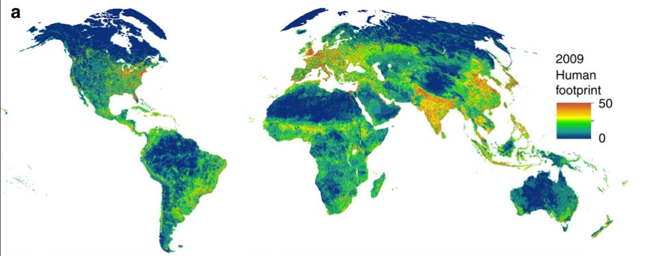

```{r packages, include=FALSE, warning=FALSE}
library(tidyverse)
library(targets)
library(magrittr)
library(ggbreak)
library(cowplot)
library(sf)
library(mapview)
source(here::here("R", "misc.R"))
source(here::here("R", "variable_shortcut.R"))
source_dir(here::here("R"))
```

```{r setup, include=FALSE}
options(htmltools.dir.version = FALSE, htmltools.preserve.raw = FALSE)
knitr::opts_chunk$set(
  fig.asp = .6, fig.retina = 3,
  out.width = "70%",
  fig.align = "center",
  dev.args = list(bg = "transparent"),
  cache = FALSE,
  echo = FALSE,
  include = TRUE,
  message = FALSE,
  warning = FALSE,
  hiline = TRUE
)

mytheme <- theme_half_open() +
  theme(
    axis.title.y = element_blank(),
    rect = element_rect(fill = "transparent"),
    legend.position = "bottom",
    legend.title = element_blank()
  )
```

```{r xaringan-themer, include=FALSE, warning=FALSE}
library(xaringanthemer)
style_duo_accent(
  primary_color = "#1381B0",
  secondary_color = "#FF961C",
  inverse_header_color = "#FFFFFF"
)
```

```{r bib-options, include=FALSE, warning=FALSE}
library(RefManageR)
library(bibtex)
tar_load(bib)

BibOptions(
  check.entries = FALSE,
  bib.style = "authoryear",
  max.names = 2,
  style = "markdown",
  dashed = TRUE)
```
```{r target-load, include=FALSE, warning=FALSE}
tar_load(c(map_modelling_site))
tar_load(c(gaussian_inla_exo_std_effects, gaussian_inla_std_effects))
tar_load(pca_clust_list)
tar_load(c(filtered_dataset, site_cl_na))
```


# Biodiversity in crisis


```{r}
knitr::include_graphics("https://production-wordpress.unep-wcmc.org/content//uploads/2021/11/Bending-the-Curve_PR.jpg")
```

```{r}
bio_crisis <- c("newbold_global_2015", "diaz_global_2019", "leclerc_bending_2020")
```


.footnote[`r Citet(bib, bio_crisis)`; [IPBES, (2019)](https://ipbes.net/sites/default/files/2020-02/ipbes_global_assessment_report_summary_for_policymakers_fr.pdf), Image credit: UNEP]

???
Scientists reach a consensus on the fact that biodiversity is going through an
unprecedented crisis. Predictions indicates that if we do not act strongly and
quickly, this crisis could have dramatic consequences that have not been seen
yet.

---
# Freshwater fishes 

```{r, out.width="58%"}
knitr::include_graphics("https://wires.onlinelibrary.wiley.com/cms/asset/b9c85273-0008-4bb3-be85-e390ec0dcaa9/wat21208-toc-0001-m.jpg")
```

```{r}
freshwater_threats <- c("he_disappearing_2017", "reid_emerging_2019")
```

.footnote[`r Citet(bib, freshwater_threats)`; [IPBES, (2019)](https://ipbes.net/sites/default/files/2020-02/ipbes_global_assessment_report_summary_for_policymakers_fr.pdf)]

???
This is particularly true for freshwater ecosystems. Although freshwater
constitute 0.01% of water on earth, they host almost 9.5% of Earth described
species. Freshwater biodiversity is threatened by terrestrial land degradation,
overexploitation, pollution, flow alteration and species alteration.

However we know little on temporal dynamics of freshwater fishes are affected by
those anthropogenic pressures.

---
# Biodiversity

.pull-left[

```{r, out.width="100%"}
knitr::include_graphics("https://files.worldwildlife.org/wwfcmsprod/images/Buffalo_fish/story_full_width/80b2nhfpi6_Buffalo_fish__c__Freshwaters_Illustrated.jpg")
```

]

```{r}
stat_biodiv <- c("jost_partitioning_2007", "hillebrand_biodiversity_2018",
  "baselga_betapart_2012")
```
--

.pull-right[

## Multidimensional concept

1. Species richness, Shannon, Simpson (Hill numbers) 
1. Total abundance
1. Dissimilarity in species composition (P/A or abundance based)

]


???
When an ecologist sampled a community in time, he faces a difficult task. Indeed, how to
describe the trends in biodiversity of this community? 

Is it the number of species, the total abundance, the dissimilarity of the
community composition through time? Should I take in account the abundance of
the species, in other word, compute Hill numbers ?

Of course, this is no one good answer. But measuring several of them, when
possible, can help us to refine our understanding biodiversity changes.  
An alternative hypothesis is that biodiversity trends are similar among them,
and that we might need only a few.

---
class: center middle
# Research questions

How do anthropogenic pressures influence the temporal trends of freshwater fish
biodiversity?

Do different biodiversity facets have the same temporal trends?

???
Regarding the previous research gap, we asked
"How do anthropogenic pressures influence the temporal trends of freshwater fish
biodiversity?" and

"Do different biodiversity facets have the same temporal trends?"

---
class: center middle
# 

Methods

---
# Fish data: RivFishTime


`r nrow(site_cl_na)` sites, spanning at least 10 years

Homogeneity within sites: protocol, abundance units, sampling period

```{r, out.width="70%"}
tar_load(map_modelling_site)
mymap <- map_modelling_site +
  coord_sf(expand = FALSE)
save_plot(here::here("talk", "images", "map_sites.png"), mymap,
  base_width = 7, base_asp = .4
)
knitr::include_graphics(here::here("talk", "images", "map_sites.png"))
```


.footnote[`r Citet(bib, "comte_rivfishtime_2021")`]

???
To answer those questions, we used the RivFishTime database which contains time
series of fish communities spanning at least 10 years. The dataset covers mostly
the so called "Western countries": the US and Canada, Western and North Europe,
Australia and Japan. For each site, we selected samplings that were identical in
terms of protocol, measurement unit and sampling season. 
After selection, we had more than 5000 sites.   

---
# Biodiversity facets

- Temporal dissimilarity:
  - Simpson based dissimilarity
  - Jaccard (Presence / absence):
    - Appearance and Disappearance 
    - Turnover and Nestedness 

- Chao richness
- Total abundance

- Complementary descriptors:
  - Percentage of exotic species richness 
  - Percentage of exotic species abundance

???
We characterised biodiversity by temporal dissimilarity of community
composition: based on abundance (with Simpson), presence/absence with the
Jaccard index. We also decomposed Jaccard in Appearance/Disappearance and
Nestedness/Turnover

We also described the Coverage based species richness (the Chao) and Total
abundance.

We also described the composition of communities in terms of exotic species 

---
# Anthropogenic pressures

## Human footprint

Human infrastructures, land-use, population density, ... 

```{r}
tar_load(c(hft_site_summary, hft_total_summary))
hft_site_summary %<>%
  mutate(across(where(is.double), scales::percent_format()))
hft_total_summary %<>%
  mutate(across(where(is.double), scales::percent_format()))
```

```{r, out.width="90%"}

```

.footnote[`r Citet(bib, "venter_sixteen_2016")`]

???
We described anthropogenic pressures using the Human Footprint index. It is a
composite index that take in account human infrastructures, land-use,
and various characteristics of human occupation. 

---

# Hierarchical linear models (INLA)

.font90[

$$
\begin{align}
    Y_{it} &= \alpha + \beta_0Time_t + \sum_{k=1}\beta_kX_k + \sum_{k=0, n\neq k}\beta_{kn}X_kX_n +\epsilon_{it}
\end{align}
$$

- $i$: site $i$, $t$: time $t$

]

???
We modelled the temporal trends of biodiversity using hierarchical linear models evaluated with INLA,
a bayesian framework that approximates posterior distribution and thus do not
rely on MCMC.

The biodiversity at a site i and time t is linearly dependent on time,
covariates and on the interaction among the covariates

---

# Hierarchical linear models (INLA)

.font90[

$$
\begin{align}
    Y_{it} &= \alpha + \beta_0Time_t + \sum_{k=1}\beta_kX_k + \sum_{k=0, n\neq k}\beta_{kn}X_kX_n +\epsilon_{it}
\end{align}
$$

- $i$: site $i$, $t$: time $t$

- $\alpha = \alpha_0 + a_l + a_m$
- $\beta_0 = \mu + b_l + b_m$
- $a_l, a_m, b_l, b_m \sim \mathcal{N}(0,\,\sigma^{2})$
- $l$: basin, $m$: site within basin

]

???
We added random effects on the intercept, alpha and on the temporal trends
quantified by the slope beta 0.
The variance of the intercept and the temporal trends were dependent on the
hydrographic basin and on the site, nested within the basin effect. 

---

# Hierarchical linear models (INLA)

.font90[

$$
\begin{align}
    Y_{it} &= \alpha + \beta_0Time_t + \sum_{k=1}\beta_kX_k + \sum_{k=0, n\neq k}\beta_{kn}X_kX_n +\epsilon_{it}
\end{align}
$$

- $i$: site $i$, $t$: time $t$

- $\alpha = \alpha_0 + a_l + a_m$
- $\beta_0 = \mu + b_l + b_m$
- $a_l, a_m, b_l, b_m \sim \mathcal{N}(0,\,\sigma^{2})$
- $l$: basin, $m$: site within basin

- Time and interactions:
  - Time
  - Time x Legacy of long term pressure (Human footprint 1993)
  - Time x Recent change in pressure (Ratio of Human footprint 2009/1993)

]
???
Today, I will show you only the effect of time (the temporal trends) and its
interaction with the legacy of long term pressure, the Human footprint of the
year 1993 and the recent change in pressure quantified by the ratio between the
human footprint of 2009 and the one of 1993

---
class: center, middle, large

# Results 

How do anthropogenic pressures influence the temporal trends of freshwater fish
biodiversity?

???
Now, How do anthropogenic pressures influence the temporal trends of freshwater fish
biodiversity? 

---
# Temporal dissimilarity

```{r}
restricted_dimension <- c(
  "hillebrand_dis_scaled", "log_total_abundance",
  "log_chao_richness", "perc_exo_sp", "perc_exo_abun")
tu <- rbind(gaussian_inla_std_effects,
  gaussian_inla_exo_std_effects) %>%
  filter(!str_detect(term, "unitabundance|Intercept|riv_str")) %>%
  filter(response %in% restricted_dimension) %>%
  mutate(
    term = str_replace_all(term, get_model_term_replacement_vulgarisation()),
    ,
    response = get_var_replacement()[response]
    ) %>%
  mutate(
      term = factor(term,
        levels = c(
          "Time",
          "PCA1\nstream gradient",
          "Legacy",
          "Recent change",
          "Time x\nPCA1\nstream gradient",
          "Time x\nLegacy",
          "Time x\nRecent change",
          "Time x\nPCA1\nstream gradient x\nLegacy",
          "Time x\nPCA1\nstream gradient x\nRecent change",
          "Time x\nLegacy x\nRecent change"
          ))
    )
```


```{r, include=FALSE}
p1 <- tu %>%
  filter(
    response == "Dissimilarity (Simpson index)"
    ) %>%
  arrange(desc(width_bar)) %>%
  plot_inla_fixed_effect() +
  mytheme +
  labs(x = "Standardized coefficients") +
  scale_x_break(c(.25, .65)) +
  theme(
    legend.position = "none",
    panel.background = element_rect(fill='transparent')
    )

p_int_0 <- p1
p_int_0$layers <- p_int_0$layers[-c(3, 4)]

p2 <- tu %>%
  filter(
    response == "Dissimilarity (Simpson index)",
    facet == "dbl_interaction"
    ) %>%
  arrange(desc(width_bar)) %>%
  plot_inla_fixed_effect() +
  mytheme +
  labs(x = "Standardized coefficients") +
  theme(legend.position = "none")

p_dblint_0 <- p2
p_dblint_0$layers <- p_dblint_0$layers[-c(3, 4)]
```

```{r, fig.asp=.65}
p_int_0
```

???
First the results temporal dissimilarity. At the x axis, I displayed the
standardized slope coefficients. At the Y axis, I displayed the effect of time,
the temporal trends and how the temporal trends is affected by the Legacy of
anthropogenic pressures, the recent changes in pressure and their interaction. 

---
class: center

# Temporal dissimilarity

Legacy of past and recent human pressure increase temporal
turnover

```{r, fig.asp=.65}
p1
```
???
Our results showed both the legacy and recent changes in anthropogenic
pressures accelerates changes in species composition, and that they have a
synergistic effect. 

---
# Abundance and richness 

```{r}
p_main_abun <- tu %>%
  filter(
    !response %in% c(
      "Dissimilarity (Simpson index)",
      "Percentage exotic abundance"
      ),
    str_detect(term, "Time")
    ) %>%
  arrange(desc(width_bar)) %>%
  plot_inla_fixed_effect(.,
    legend_present = TRUE,
    xaxis_title = TRUE
    ) +
  labs(x = "Standardized coefficients") +
  mytheme

p_main_abun_0 <- p_main_abun
p_main_abun_0$layers <- p_main_abun_0$layers[-c(3, 4)]
```

```{r, fig.asp=.65, out.width="70%"}
p_main_abun_0
```

???
Now, the same question with the total abundance, species richness and the
percentage of exotic species in the communities. 

---
class:center
# Abundance and richness 

Positive temporal trends `r Citep(bib, "klink_meta-analysis_2020")`, modulated by anthropogenic pressures

```{r, fig.asp=.65, out.width="70%"}
p_main_abun +
guides(col = guide_legend(nrow = 2))
```


???
We found a global positive temporal trends, confirming previous results. 
We also see that legacy increase the temporal trends of total abundance and
species richness. Recent increase in anthropogenic pressure decrease
temporal trends of abundance and richness but increase the one of percentage of
exotic species. 

---
class: center, middle, large
# Typology of biodiversity temporal trends 

Do different biodiversity facets have the same temporal trends?

???
Now, Do different biodiversity facets have the same temporal trends?

---
class: center
# Typology of biodiversity temporal trends 

Three dimensions: Dissimilarity, Species richness, Total abundance

```{r}
tar_load(c(
    pca_clust, site_cl_rm,
    site_no_drivers_inla_tot,
    clust_var))
pca_clust <- compute_rotated_pca(
     site_no_drivers_inla_tot[, clust_var],
     naxis = 5)

pca_clust_list <- get_pca_clust_list(
      pca = pca_clust$rotated,
      site_cl = site_cl_rm,
      label_size = 3,
      add_point = FALSE,
      add_ellipse = FALSE,
      color_scale = NULL,
      axis_list = list(
        c("RC1", "RC2"),
        c("RC1", "RC3"),
        c("RC1", "RC4"),
        c("RC1", "RC5"),
        c("RC2", "RC3"),
        c("RC2", "RC4"),
        c("RC2", "RC5"),
        c("RC3", "RC4"),
        c("RC3", "RC5"),
        c("RC4", "RC5"))
      )
```

```{r, fig.asp = .5, out.width="80%"}
plot_grid(
  plotlist = pca_clust_list$pca_list[c(1, 3)],
  nrow = 1, ncol = 2
)
```

???
The PCA over the temporal trends displayed a first axis related to dissimilarity
measurement, a second related to species richness and the fourth axis to Total
abundance temporal trends 

---
class: center, middle
# Take home messages

**Past and recent anthropogenic pressures** interacts to drive biodiversity trends
in fish freshwater communities

**Several dimensions** of temporal trends of biodiversity


???
So far, I showed you that

**Past and recent anthropogenic pressures** affect and interact to drive biodiversity trends
in fish freshwater communities


**Several dimensions** of temporal trends of biodiversity

So it might be necessary to assess them simultaneously

---
# Thanks

```{r}
knitr::include_graphics("images/collab_isu.png")
```

???
I want to warmly thank my post doc supervisors for the great collaboration,
Lise, Xingli and Julian 

---
class: center, middle

# Thanks

We are indebt to all the researchers and agencies who monitored fish abundance
through time and provided their data for this project.

Lise Comte achieved the Herculean task to assemble RivFishTime `r Citep(bib, "comte_rivfishtime_2021")`.

Thank you for listening to me!

Any questions?

https://alaindanet.github.io

**Past and recent anthropogenic pressures** interacts to drive biodiversity trends
in fish freshwater communities

**Several dimensions** of temporal trends of biodiversity

???
I would like to put forward the tremendous work of all the researchers and
agencies over the world who monitored fish abundance through time and provided
their data for this project.

I would also like to highlight the herculean work of Lise Comte in assembling
the RivFishTime database!

Thank you! 

---
# References

---
# Annexes

---
# Human footprint

- Distribution of human footprint 1993 in Rivfishtime (global):
  - Wilderness (< 1): **`r hft_site_summary$perc_wilderness`** (`r hft_total_summary$perc_wilderness`) 
  - Intact (1 <= x <= 4): **`r hft_site_summary$perc_intact`** (`r hft_total_summary$perc_intact`)
  - Degraded (> 4): **`r hft_site_summary$perc_degraded`** (`r hft_total_summary$perc_degraded`)

```{r}
hft_r_site <-  hft_site_summary[["hft_ix_c9309_log2_ratio"]][[1]][1:6]
hft_perc_site <-  scales::percent(2^hft_r_site - 1)
hft_r_total <- hft_total_summary[["hft_ix_c9309_log2_ratio"]][[1]][1:6]
hft_perc_total <- scales::percent(2^hft_r_total - 1)
```

--

- Legacy of past human pressure: Human footprint 1993

--

- Recent variation of human pressure: Human footprint 2009 - Human footprint 1993
  - RivFishTime: mean: `r hft_perc_site["mean"]`,
    1st quartile: `r hft_perc_site["1st_quart"]`, 3rd quartile: `r hft_perc_site["2nd_quart"]`
  - Global: mean: `r hft_perc_total["mean"]`,
    1st quartile: `r hft_perc_total["1st_quart"]`, 3rd quartile: `r hft_perc_total["2nd_quart"]`

???
- Stream gradient: upstream to downstream
- Human pressure: Rivfishtime have sites less degraded than global scale
  - Recent changes in human pressure: log2
